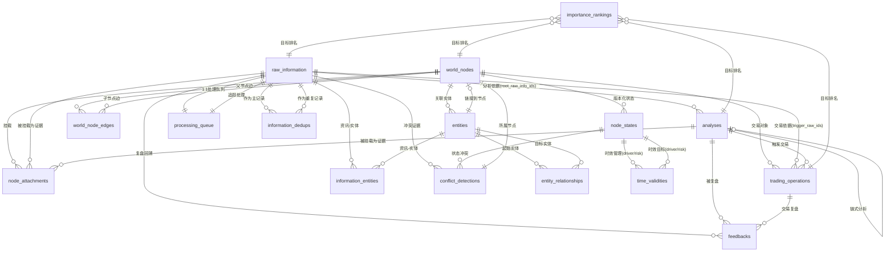

# 数据库表关系图

## ER 图（Mermaid）



---

## 表关系详表

### 核心依赖链

```
raw_information          ← 一切证据的起点
    │
    ├── information_entities   ← 提取的实体
    │       └── entities       ← 实体字典
    │
    ├── analyses              ← 分析信息
    │       ├── feedbacks       ← 复盘
    │       └── trading_operations ← 交易操作
    │               └── feedbacks
    │
    ├── node_attachments      ← 挂载到节点
    │       └── world_nodes
    │               └── node_states ← 版本化状态
    │
    └── processing_queue      ← 处理流水线
```

### 证据链：从产出到来源

```
feedbacks ──▶ trading_operations ──▶ analyses ──▶ raw_information
    │               │                      │              │
    │    trigger_trade_id    trigger_analysis_id   root_raw_info_ids[]
    │                                    
    └────────── trigger_analysis_id ──────────────┘
```

### 知识图谱：实体关系网络

```
entities ──(source)──▶ entity_relationships ◀──(target)── entities
    │                                                            │
    └── information_entities ──┘                    └── linked_node_id ──▶ world_nodes
             │
        raw_information
```

### 版本化状态链（As-of-Time 基础）

```
world_nodes ──▶ node_states (v1) ──▶ node_states (v2) ──▶ node_states (v3, current)
                     │                      │                      │
                effective_to           effective_to           effective_to = NULL
                = v2.from              = v3.from
```

### 各表外键一览

| 表 | 外键列 | 引用表 | 关系类型 |
|---|---|---|---|
| `world_node_edges` | `parent_node_id` | `world_nodes` | M:N (关联表) |
| `world_node_edges` | `child_node_id` | `world_nodes` | M:N (关联表) |
| `node_states` | `node_id` | `world_nodes` | N:1 |
| `node_attachments` | `node_id` | `world_nodes` | N:1 |
| `node_attachments` | `attachment_id` | `raw_information` 或 `analyses` | 多态（无 FK 约束） |
| `entities` | `linked_node_id` | `world_nodes` | N:1 |
| `information_entities` | `raw_info_id` | `raw_information` | N:1 |
| `information_entities` | `entity_id` | `entities` | N:1 |
| `entity_relationships` | `source_entity_id` | `entities` | N:1 |
| `entity_relationships` | `target_entity_id` | `entities` | N:1 |
| `analyses` | `parent_analysis_id` | `analyses` | 自引用 N:1 |
| `analyses` | `root_raw_info_ids` | `raw_information` | M:N (UUID[]) |
| `trading_operations` | `target_node_id` | `world_nodes` | N:1 |
| `trading_operations` | `trigger_analysis_id` | `analyses` | N:1 |
| `trading_operations` | `trigger_raw_ids` | `raw_information` | M:N (UUID[]) |
| `feedbacks` | `trigger_analysis_id` | `analyses` | N:1 |
| `feedbacks` | `trigger_trade_id` | `trading_operations` | N:1 |
| `information_dedups` | `primary_info_id` | `raw_information` | N:1 |
| `information_dedups` | `duplicate_info_id` | `raw_information` | N:1 |
| `processing_queue` | `raw_info_id` | `raw_information` | 1:1 (UNIQUE) |
| `conflict_detections` | `node_id` | `world_nodes` | N:1 |
| `conflict_detections` | `existing_evidence_id` | `raw_information` | 软引用 |
| `conflict_detections` | `conflicting_evidence_id` | `raw_information` | 软引用 |
| `time_validities` | — | `node_states` | 软引用 (target_type+target_id) |
| `importance_rankings` | — | 任意表 | 软引用 (target_type+target_id) |

### 索引策略

| 表 | 索引 | 类型 | 用途 |
|---|---|---|---|
| `raw_information` | `content_hash` | UNIQUE | 去重快速查找 |
| `raw_information` | `search_vector` | GIN | 全文搜索 |
| `raw_information` | `embedding` | HNSW | 向量相似度 |
| `raw_information` | `published_at` | BTREE | 时间范围查询 |
| `raw_information` | `processing_status` | BTREE | 队列过滤 |
| `analyses` | `search_vector` | GIN | 全文搜索 |
| `analyses` | `embedding` | HNSW | 向量相似度 |
| `node_states` | `(node_id, version)` | UNIQUE | 版本唯一性 |
| `node_states` | `(node_id, effective_to)` | BTREE | 当前状态查询 |
| `node_states` | `key_evidence_ids` | GIN | 证据回溯 |
| `world_nodes` | `(name, node_type)` | UNIQUE | 节点去重 |
| `entities` | `(normalized_name, entity_type)` | UNIQUE | 实体去重 |
| `entities` | `aliases` | GIN | 别名匹配 |
| `entity_relationships` | `(source_entity_id, relationship_type)` | BTREE | 图遍历正向 |
| `entity_relationships` | `(target_entity_id, relationship_type)` | BTREE | 图遍历反向 |
| `node_attachments` | `(node_id, role)` | BTREE | 按角色筛选证据 |
| `processing_queue` | `raw_info_id` | UNIQUE | 1:1 关联 |
| `processing_queue` | `status` | BTREE | 状态过滤 |
| `information_dedups` | `(primary_info_id, duplicate_info_id)` | UNIQUE | 去重关系唯一 |
